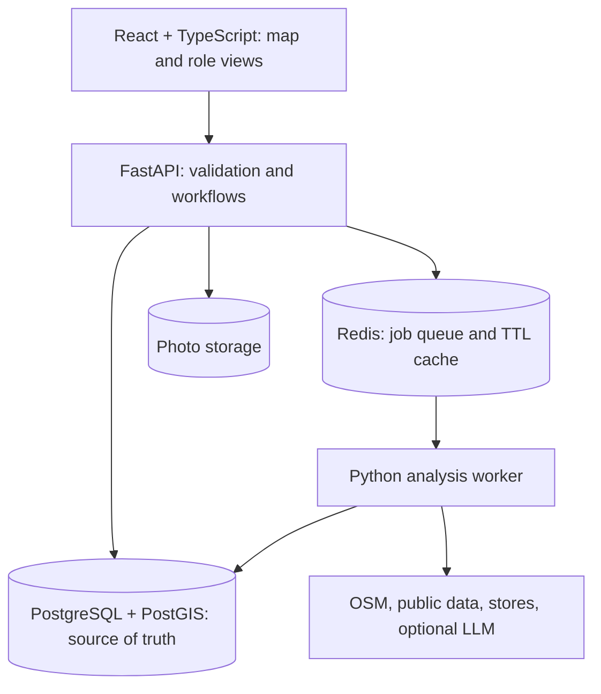

# Savo SiteScout — Architecture

**Status:** Agreed design, 28 September 2026  
**Companion:** [Project decisions](Savo_SiteScout_Project_Decisions.md)  
**Scope:** Approach A (complete M1–M3) with selected Approach B features and Redis. This describes planned implementation, not completed code.

## End-to-end example

BD Manager selects Velachery → receives a saved Area Fitness Report → assigns a scouting hotspot → BD Executive captures a property on a phone → system evaluates it → BD Manager requests a catchment study → Survey Manager splits and assigns zones → Survey Executives submit lane observations → catchment insights update the property evaluation → BD Manager decides with an auditable history.

Velachery is an illustrative Chennai scenario. Demonstration scores and simulated property data must be clearly labelled.

## System

A modular FastAPI codebase supplies an API and a separate Redis-backed worker (for example RQ). The API returns `202 Accepted` and a job ID for longer M1 analysis; `GET /jobs/{id}` reads durable progress from PostgreSQL. The worker records queued, fetching, scoring, explaining, completed or failed states. Retry bounded, idempotent steps. Redis also caches external responses with TTL, source and fetch time. Postgres remains authoritative for jobs, reports, assignments, properties, surveys, score versions and audit records. If a provider fails, show a timestamped eligible cached snapshot; if Redis is down, show a retryable analysis error while existing reports and drafts remain usable.

## M1: Area intelligence

A BD Manager selects Chennai geography by locality, pincode or map cells on an interactive OSM map. Store the resulting polygon or union of selected cells and its selection method. A city-wide precomputed grid or H3 heatmap is **not required** for this first version. Spatial queries against normalized OSM POIs, roads, suitable Indian public data and operational Savomart stores produce available signals. Do not present POI counts as population. Mark missing people/homes data as unavailable or explicitly identify proxies.

A deterministic scoring function normalizes available signals, applies documented versioned weights and stores each metric's raw value, normalized value, weight, contribution, source, time and limitations. Missing signals have an explicit policy. Rank a few scouting locations within the selected area. Save timestamped reports and evidence snapshots so they can be revisited and compared. “Why this score?” shows the components. An optional swappable LLM narrates validated computed facts; a deterministic explanation remains available if it fails.

## M2: Property scouting and evaluation

The BD Manager assigns a hotspot from M1. The assigned BD Executive records GPS, rent, physical/commercial details, notes and validated photos in a short mobile form. Validate missing values and flag possible nearby duplicates for review. Combine captured fields with nearby public and store data to produce a property score, evidence, insights, risks and recommendation.

Use a small pipeline such as `scouted → shortlisted → survey_requested → under_review → approved/rejected`, with sensible rejection/return paths. Every transition records actor, reason and timestamp. Keep property evaluations append-only: correcting rent or completing a catchment study creates a new score version and retains the old one.

## M3: Catchment operations

A BD Manager requests a study for **a property or an analysed area**. The Survey Manager views requests, defines a catchment polygon, splits it into non-overlapping zones, assigns executives and tracks progress. Survey Executives capture lane-level observations, GPS accuracy, time and notes on a phone. Browser draft storage preserves incomplete work on a weak connection. A client-generated submission ID prevents duplicates on retry; full offline photo synchronization and conflict merging are deferred.

Use PostGIS overlap and intersection checks to avoid duplicate zones and find existing completed studies covering the new target. Reuse a study if its age and coverage meet documented configurable thresholds; assign only uncovered work where feasible. Flag GPS mismatch for manager review. Aggregate completed lane observations into catchment insights linked to the area or property, then create property evaluation version N+1 when applicable.

## Data structures and algorithms

| Structure | Purpose | Algorithm or operation |
|---|---|---|
| Relational records and foreign keys | Four users/roles, assignments, reports, properties, studies and decisions | Ownership checks and workflow joins |
| PostGIS points, polygons and GiST indexes | POIs, stores, properties, areas and survey zones | Containment, intersection, overlap and metric proximity |
| Structured metric evidence | Raw, normalized, weighted values and provenance | Deterministic weighted sum, hotspot ranking and score explanation |
| Append-only score/action records | Evaluation and decision history | Compare versions and trace actor/reason |
| Redis queue and TTL key–value cache | Async M1 jobs and external snapshots | Enqueue, bounded retry, cache expiry |
| Browser draft object | Incomplete lane survey | Autosave, restore and idempotent submit |

Suggested core tables: `users`, `areas`, `area_analyses`, `area_reports`, `analysis_jobs`, `scout_assignments`, `properties`, `property_photos`, `property_evaluations`, `stage_transitions`, `catchment_studies`, `survey_zones`, `lane_captures`, `stores` and `poi`. Use foreign keys, uniqueness for submission IDs, geometry indexes and validated JSON evidence. Record `source`, `fetched_at`, `geography`, `transformation`, `scoring_version` and a demo/proxy marker where needed. Use geography or an appropriate projected CRS for distances in metres.

## API, access and reliability

Version endpoints under `/api/v1`: area analyses and reports; jobs; scouting assignments; properties and evaluations; catchment requests, zones and lane submissions. Pydantic validates coordinates, field limits and payloads. Seeded identities keep demo access simple, but backend role and object ownership checks protect each assignment; a bare frontend role switcher is insufficient as security. Validate upload type, contents and size and assign server-side filenames. Keep store-service credentials and LLM keys in server environment variables, out of Git, frontend bundles and AI exports.

Give the optional LLM only a bounded structured facts packet. Treat field notes as untrusted, validate output schema and reject unsupported numeric claims. AI cannot determine a score or block a manager decision. Show loading, empty, failure and stale-cache states. Use Savomart purple `#782B90` and yellow `#FFF200`, with dedicated mobile field flows.

## Delivery order and limits

Ship and manually test the M1 → M2 → M3 persona handoff before extras. Focus tests on score rules, spatial overlap/reuse, object authorization, retry/idempotency and the full workflow. Defer city-wide H3 maps, OSRM travel-time models, conversational analyst, full offline synchronization and PDF export. The README should state what is actually implemented, data sources, setup and demo accounts, scoring and AI methodology, limitations, AI session history and video link.
