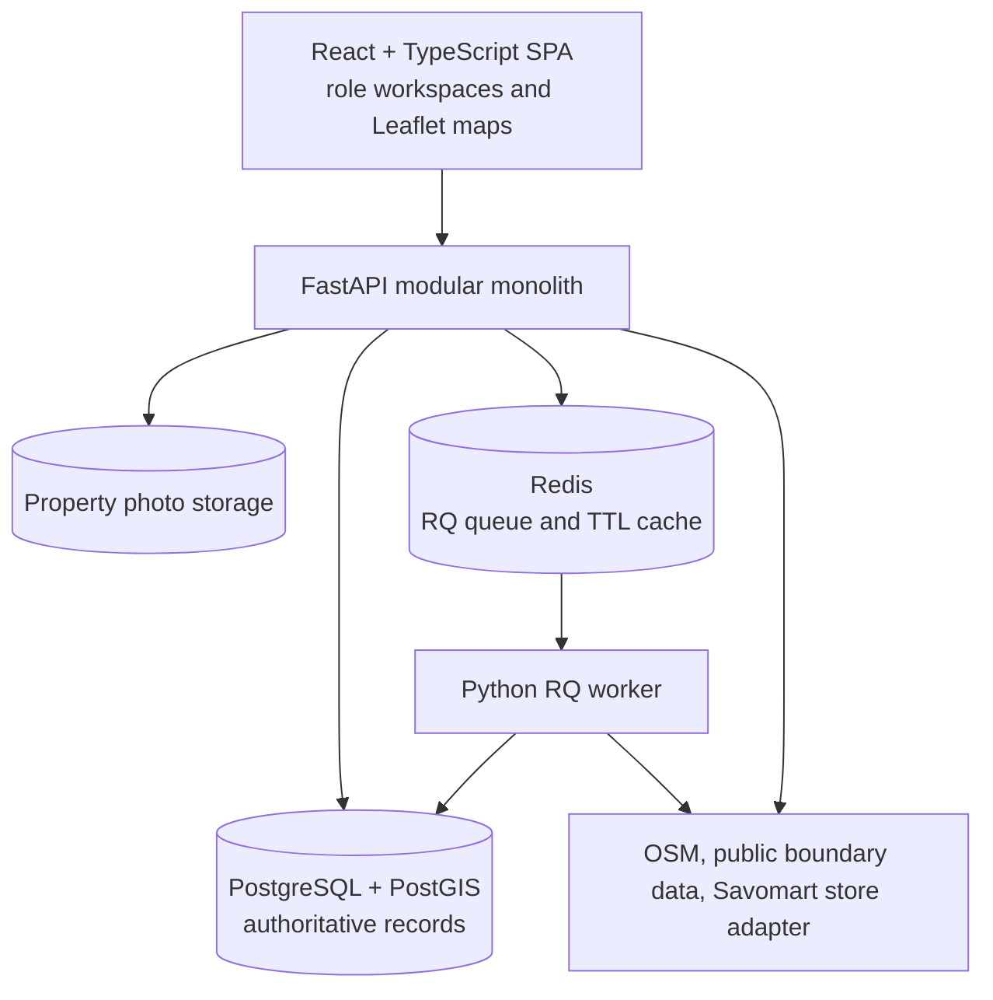

# Savo SiteScout — Merged Architecture

**Status:** Current architecture and enhancement roadmap, 29 September 2026
**Sources:** [Current project architecture](ARCHITECTURE.md), [Architecture proposal](ARCHITECTURE_c.md), [Project decisions](Decisions.md)
**Implementation status:** M1, M2, and M3 workflows are present in the repository. This document distinguishes shipped behavior from future recommendations; it is not a claim that every proposed quality or scalability feature is implemented.

## 1. Product and workflow

Savo SiteScout helps Savomart decide which Chennai area to scout, which property to advance, and whether its catchment supports a store. The connected workflow is:

1. A BD Manager selects an area such as Velachery and reviews a timestamped Area Fitness Report, its evidence, and suggested scouting hotspots.
2. The manager assigns a hotspot to a BD Executive, who captures a corrected GPS position, property details, rent, and validated photos.
3. The system creates a deterministic property evaluation. The BD Manager reviews evidence and records pipeline decisions with reasons and history.
4. The manager requests a catchment study for a property or saved area report. A Survey Manager reviews reuse coverage, splits remaining work into zones, and assigns Survey Executives.
5. Survey Executives collect GPS-tagged lane observations. Completed catchment results update the study summary and append a new property evaluation version when the study targets a property.

Velachery, bundled store points, and scripted survey observations are demo examples, not operational claims. The interface and saved evidence must distinguish sourced, cached, proxy, missing, field-survey, and simulated data.

## 2. Personas and capabilities

| Role | Current workflow |
|---|---|
| BD Manager | Search/select areas, analyze and compare reports, assign scouting, inspect properties, request catchment studies, and record pipeline decisions. |
| BD Executive | View owned assignments, capture a property from the field, correct GPS, add details/photos, and submit for evaluation. |
| Survey Manager | Review catchment requests and reuse coverage, plan non-overlapping zones, assign Survey Executives, and monitor survey progress/results. |
| Survey Executive | View owned zones, recover a local draft, capture lane observations and GPS, submit idempotently, and complete a zone. |

The role switcher and seeded identities are for demonstration only. They are not production authentication.

## 3. System architecture

- **Frontend:** React, TypeScript, Vite, React Leaflet, OpenStreetMap tiles, and role-oriented M1/M2/M3 workspaces.
- **API:** FastAPI routes under `/api/v1`, Pydantic request/response schemas, demo identity dependencies, and workflow services.
- **Worker:** separate Python RQ process for asynchronous M1 enrichment/scoring and retryable jobs.
- **Database:** PostgreSQL 16 with PostGIS. It is authoritative for geometry, jobs, reports, metric evidence, assignments, properties, evaluations, transitions, catchment studies, zones, and lane captures.
- **Redis:** RQ queue transport and expiring external-response cache. Durable workflow state remains in PostgreSQL.
- **Photos:** validated image uploads stored outside the database, currently on a local/Docker volume.

This is a modular monolith, not a microservice system. Keep API and worker as separate processes that use the same application modules and database.

## 4. Module boundaries and dependency direction

The current code is organized by capability (`m1_areas`, `m2_properties`, `m3_surveys`, `scoring`, `jobs`, `api`, and `db`). Continue to make these boundaries clearer as features grow:

- **API routes** authenticate/authorize the demo principal, validate transport input, call a workflow operation, and map expected errors to HTTP responses.
- **Workflow services** coordinate domain actions and transactions for their capability.
- **Scoring functions** remain deterministic and side-effect free; external I/O stays outside scoring.
- **Repositories/data access** own increasingly complex SQL and PostGIS queries. Some current services still contain direct ORM queries; extracting those queries is a gradual improvement, not a prerequisite refactor.
- **Adapters** isolate Nominatim, Overpass, the optional Savomart store service, Redis, and photo storage behind small replaceable functions/interfaces.

Avoid introducing an elaborate domain framework for its own sake. Add interfaces where provider swapping, testing, or isolation actually benefits. Import-boundary linting can be added once module boundaries stabilize.

## 5. Data model

Current core records include:

- M1: `areas`, `area_analyses`, `analysis_jobs`, `area_reports`, `area_metric_evidence`, `scouting_suggestions`, and `external_data_snapshots`.
- M2: `scout_assignments`, `properties`, `property_photos`, `property_evaluations`, and `property_stage_transitions`.
- M3: `catchment_studies`, `survey_zones`, and `lane_captures`.

Records use foreign keys and UUID identifiers. Geometry is stored in SRID 4326. Property evaluations are unique by `(property_id, version)`; lane captures have a unique client submission UUID. Metric and survey summaries use validated structured data, including JSONB where the payload evolves by scoring version.

**Enhancement:** keep every derived result reproducible by persisting its input snapshot, source timestamp, geography, transformation, evidence kind, and scoring version. Where a metric does not apply, record it as missing/unavailable with an explicit scoring policy rather than silently dropping it.

## 6. Spatial strategy

M1 accepts OSM locality/pincode polygons, explicit approximate radii for point-only geocoder results, or user-selected 0.01-degree map cells. Selected geometry is validated against Chennai bounds. A precomputed city-wide grid or H3 heatmap is not required for the current workflow.

M2 uses PostGIS for area containment and point-distance checks; proximity checks are expressed in metres using geography operations. The 750 m OSM evidence region is buffered in PostGIS geography. M3 calculates overlap in EPSG:32644, unions all eligible recent source-study coverage, subtracts that union from the target, partitions remaining metric geometry into clipped longitudinal zones, and rejects zones with area overlap. Lane observations outside a zone beyond GPS tolerance are retained and flagged for review.

**Spatial enhancement:** the proposed 500 m shared cell grid could later support comparable workload sizing and batch scoring, but it adds ingestion and boundary-maintenance cost. Do not introduce it until measured needs justify it. Preserve source geometries in SRID 4326 for interchange while continuing to use projected/geography-aware calculations for metric operations.

Current M3 zone generation is geometric rather than road-network-aware. It does not promise equal lane counts or walking effort. Routing and advanced workload balancing remain future work.

## 7. Workflow contracts

### M1: Area intelligence

- Search is submitted explicitly; Nominatim results and PIN boundary sources retain provenance.
- A point result is never presented as an official boundary. The user must choose an approximate radius or map geometry.
- The API creates an analysis and durable PostgreSQL job record, returns a job ID, and the UI polls progress.
- The RQ worker records queued/fetching/scoring/completed or failed status and supports bounded retry.
- Reports save deterministic scores, evidence, source snapshots, geometry, and ranked scouting suggestions.
- Reports can be reopened and compared. The evidence view exposes raw values, normalization, weights, contributions, sources, times, geography, cache age, and limitations.

### M2: Property scouting and evaluation

- A manager assigns a persisted M1 suggestion to a named BD Executive.
- An executive submits GPS, address, rent, size, frontage, road width, property/floor type, visibility, condition, utilities, notes, and up to eight validated photos.
- The backend checks assignment ownership, validates data and image content, checks area containment and distance from the hotspot, and flags likely duplicates for manager review.
- Property scoring is deterministic and versioned. Evaluations are append-only; stage transitions record actor, time, old/new stage, and reason.
- The property form currently submits synchronously while nearby external evidence is gathered. Moving M2 enrichment to a durable background job is a reliability improvement if latency becomes a problem.

### M3: Catchment operations

- Managers request studies for a property or saved area report. Property targets use a configured radius; area targets use the saved report geometry.
- The reuse check unions all recent completed studies (90-day maximum age by default) and records every contributing source study ID. At least 80% combined target coverage reuses the study without zones; partial combined overlap is removed from new survey geometry. Both thresholds are configurable.
- Survey Managers split remaining geometry into 1-8 clipped non-overlapping zones and assign survey executives.
- Survey submissions include client UUID, lane name, coordinates, GPS accuracy, observation time, residential/commercial counts, pedestrian/vehicle activity ratings, and notes. Server validation constrains values and Chennai coordinates.
- Repeated submission UUIDs return the existing record for the same survey work; another work item cannot claim that UUID. Browser `localStorage` preserves incomplete drafts per zone, including the UUID and corrected map point.
- Completing all zones aggregates observations and spatial coverage. The system flags GPS mismatches, records evidence limitations, and appends a catchment-aware property evaluation version where applicable.

## 8. Scoring and evidence

Area and property scores are deterministic, versioned weighted sums. Normalized values are clamped to `0..1`; metric contribution is normalized value multiplied by weight and 100. Rules and weights are currently implemented in Python scoring modules rather than an external YAML configuration.

The M1 evidence ledger distinguishes mapped-feature proxies from population data. Population/household data is unavailable and excluded from the area score. Store distance is straight-line, not travel time; missing store data follows the documented neutral-value policy. Property v1 uses field and mapped-activity signals. Catchment-aware property v2 scales existing metric contributions and adds a 10% field-observed catchment signal.

**Enhancements adopted from the proposal:**

- Add a documented confidence/completeness indicator that reflects missing, cached, proxy, demo, and field evidence. Keep it distinct from the numeric fitness score until its calculation is validated.
- Move scoring thresholds/weights into versioned configuration only when operators need to tune them without changing code; persist the full configuration/version with each result.
- Test each signal and threshold independently, including missing and simulated evidence. Never convert OSM feature counts or lane observations into population or continuous-footfall claims.
- An LLM is not part of current runtime behavior. If later introduced, it may explain a bounded facts payload only; validate its schema and numeric claims and retain a deterministic fallback. It must never calculate scores or block decisions.

## 9. API, access, and reliability

All APIs are versioned under `/api/v1`. Pydantic validates coordinates, lengths, ranges, enum-like values, and upload metadata/content. Backend dependencies enforce role checks; service queries enforce assignment ownership. A hidden/not-found response can avoid disclosing the existence of another user's objects.

The current API uses FastAPI's standard error responses; it does not yet implement the proposal's single domain-error envelope, cursor pagination, or generated TypeScript client. These are reasonable consistency improvements as endpoint count grows, but are not prerequisites for the demo workflow.

External credentials are server-side environment variables. Cached or demo evidence is labeled in report data/UI. Redis failures must not erase saved reports or field drafts. Retries must be bounded and operations that can be replayed should be idempotent. Do not log credentials, tokens, or sensitive field notes.

## 10. Feature inventory and roadmap

### Implemented

- Four role workspaces with seeded demo identities and backend role/ownership checks.
- Chennai locality/pincode/map geometry selection, OSM enrichment, Redis caching, RQ analysis jobs, durable progress/retry, saved reports, evidence provenance, score explanations, comparison, and scouting suggestions.
- Hotspot assignment, mobile-oriented property capture, GPS correction, image validation/storage, property evaluation, manager pipeline, and append-only evaluation/stage history.
- Catchment requests for property or area, spatial reuse and partial-coverage subtraction, zone planning/assignment, lane capture, local draft recovery, idempotent submit, progress/summary, GPS mismatch review, and property rescoring.

### Recommended next enhancements

1. Promote `backend/scripts/verify_full_workflow.py`, `verify_m3_reuse_union.py`, and `verify_spatial_buffers.py` into repeatable CI integration checks with isolated test data, alongside focused scoring, access, geometry, retry, and workflow tests.
2. Aggregate catchment observations across reused studies with spatial deduplication; the current summary statistics come from the most recent contributor.
3. Add a confidence/completeness indicator with clear methodology and tests, separate from score.
4. Move M2 enrichment to durable asynchronous processing if field-save latency warrants it.
5. Standardize domain errors and HTTP error envelopes; consider cursor pagination and generated API types as the surface grows.
6. Add structured request/job logging, static checks, dependency/security checks, and CI enforcement for the chosen conventions.
7. Keep design tokens centralized and strengthen mobile usability/accessibility checks for field roles.

### Deferred or out of scope

- Production identity provider and full authentication/authorization lifecycle.
- City-wide H3/500 m precomputed grid, heatmap, and batch POI aggregation until needed.
- Full offline sync, cross-device draft synchronization, conflict merging, offline photo uploads, and tile caching.
- Road-network routing, drive-time analysis, advanced cannibalisation, and statistically representative survey sampling.
- PDF exports, conversational analyst, and runtime LLM narration.

## 11. Quality gates

Maintain focused checks for deterministic scoring and versioning, job retry, geometry validation and overlap, object ownership, upload validation, idempotent lane submissions, reuse thresholds, and the end-to-end M1 → M2 → M3 handoff. The local verification scripts exercise the persisted workflow and PostGIS geometry; wire them into CI with isolated data so regressions are caught on every change. Run frontend typecheck/build and backend tests in CI; add lint, dependency audit, and security checks as configured for the repository.

## 12. Decisions and trade-offs

| Decision | Reason and trade-off |
|---|---|
| Modular monolith, separate API and worker processes | Simple deployment with capability boundaries; modules can be extracted only if operating scale demands it. |
| PostgreSQL/PostGIS is authoritative; Redis is queue/cache | Durable business history stays transactional in Postgres; Redis provides work transport and short-lived cache. |
| User-selected cells and source polygons before a shared city grid | Lower setup cost and immediate geography flexibility; workload units are less standardized. |
| Deterministic, explainable scoring before AI | Reproducible decisions and usable reports without an LLM; less free-form narrative. |
| Append-only evaluations and transitions | Preserves decision history and evidence; grows record count over time. |
| Local photo storage and localStorage drafts for demo | Minimal infrastructure; production needs object storage and more robust offline synchronization. |
| Straight-line store distances and projected geometric survey strips | Simple, testable first implementation; does not represent travel time or equal field effort. |

## 13. Source of truth and maintenance

`Decisions.md` records product scope and accepted trade-offs. This merged document is the consolidated architecture reference. `README.md` remains the operational guide and must describe what is actually implemented, how to run it, sources/evidence labels, scoring rules, demo identities, limitations, and test commands. When code changes affect architecture, update this document and README in the same change. Keep the original architecture proposal available for historical context; do not treat its unimplemented proposals as shipped features.
