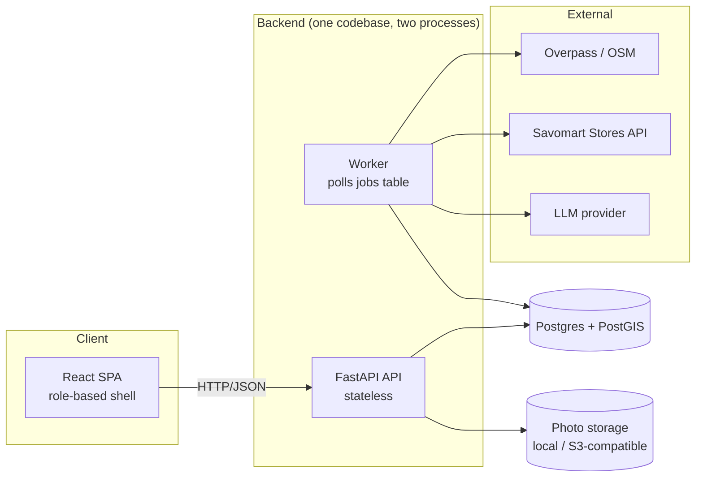
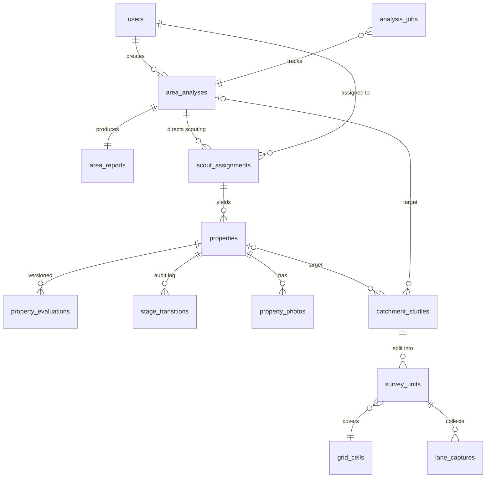
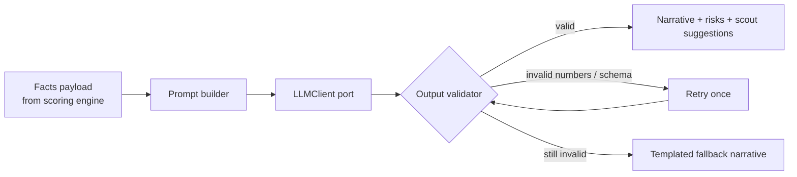
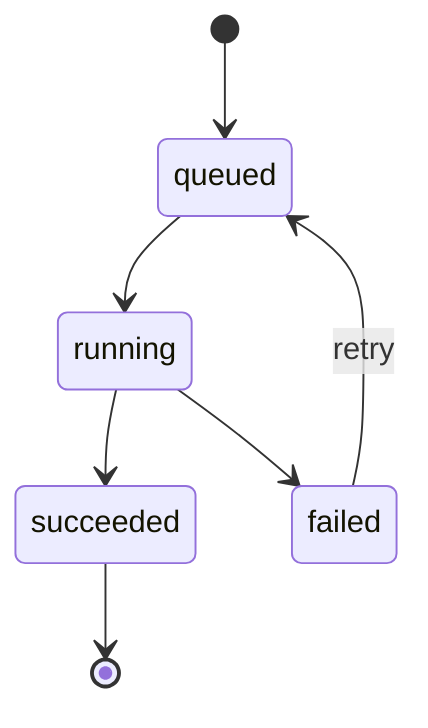
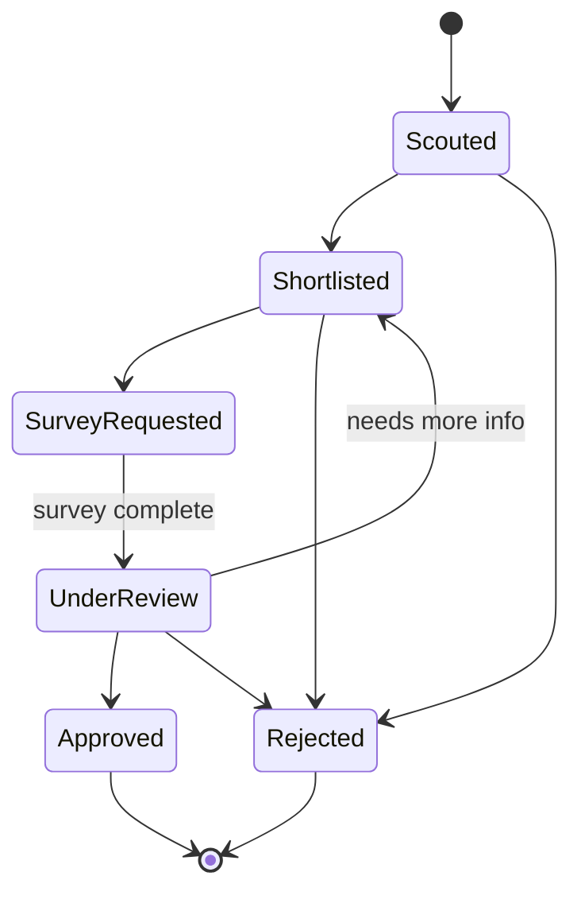
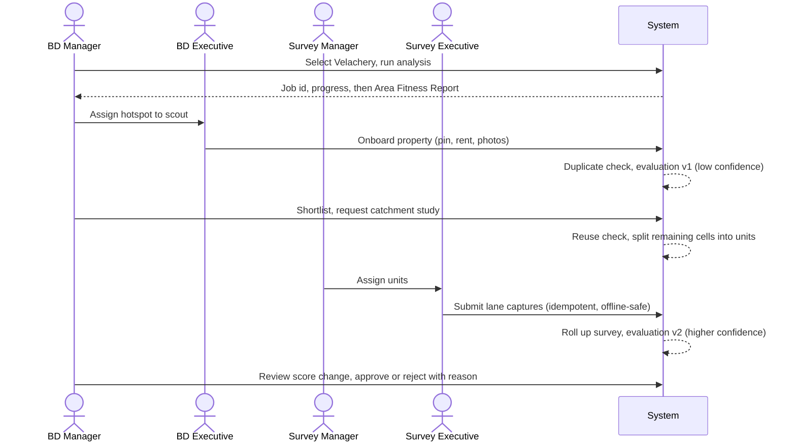

# Savo SiteScout: Historical Architecture Proposal

> Historical proposal only. This file is retained as input to the merged architecture; some proposals below are not implemented or were superseded. Use [ARCHITECTURE_MERGED.md](ARCHITECTURE_MERGED.md) as the current reference.

> Expansion intelligence platform for Savomart's Chennai region.
> Takes a store location decision from **"which area?"** to **"which property?"** to **"is the catchment right?"**

This document describes the system design, the reasoning behind it, and the trade-offs we accepted. Decisions are recorded in short ADRs under `docs/adr/`.

---

## 1. Goals and non-goals

### Goals
- A working end-to-end core loop: **Area analysis → Scouting → Property evaluation → Catchment survey → Re-scored decision**.
- **Explainable** scoring: every rating can be traced to raw signals, weights and data sources.
- **Grounded AI**: the LLM explains computed facts; it never invents numbers.
- **Maintainable**: strict module boundaries, thin transport layer, pure business logic.
- **Scalable by design**: stateless API, separable worker, precomputed spatial units, clear upgrade paths.
- **Field-ready**: mobile-first capture flows that tolerate weak networks.

### Non-goals (v1)
- Microservices, Kubernetes, or a distributed cache.
- A full auth system (seeded users and a role switcher are used).
- Real rent or income data (mocked and clearly labelled).
- Perfect polygon geometry (grid cells approximate boundaries).

---

## 2. Personas and their jobs

| Persona | Primary job | Home view |
|---|---|---|
| BD Manager | Analyse areas, direct scouting, decide pipeline moves, request studies | Map + reports + pipeline board |
| BD Executive | Know where to scout, onboard properties from the field | Assigned hotspots + mobile property form |
| Survey Manager | Receive requests, split work, assign, track | Request inbox + assignment board |
| Survey Executive | Capture lane-level data on the street | Assigned units + mobile lane form (offline drafts) |

---

## 3. System overview



**Style:** modular monolith. One deployable, one database, strict internal module boundaries. The API and worker run as separate processes from the same image so they scale independently.

**Why not microservices:** operational overhead outweighs the benefit at this scale. Module rules give us most of the maintainability, and the boundaries are clean enough to extract a service later.

---

## 4. Layering and dependency rules

```
api  →  services  →  domain  ←  repositories
                        ↑
                      ports  ←  adapters (LLM, Overpass, Stores, storage)
```

1. **`api`** (routers): parse input, call one service method, return a response model. No business logic, no SQL.
2. **`services`**: orchestrate use cases and own transactions. One service owns one aggregate.
3. **`domain`**: entities, value objects, state machines, scoring engine. **Pure Python.** Never imports FastAPI, SQLAlchemy, or an HTTP client.
4. **`repositories`**: the only place SQL and PostGIS queries live.
5. **`ports` / `adapters`**: every external system sits behind an interface. Swapping a provider means writing one adapter and changing config.

Enforce with an import-linter contract in CI so these rules cannot silently erode.

---

## 5. Repository layout

```
savomart-fullstack-hackathon-2026/
├── backend/
│   └── app/
│       ├── core/            # config (pydantic-settings), db session, logging, error types
│       ├── modules/
│       │   ├── identity/    # users, roles, permission dependency
│       │   ├── areas/       # grid cells, pincode / locality resolution
│       │   ├── analysis/    # area analyses and Area Fitness Reports
│       │   ├── scouting/    # properties, photos, duplicate detection, assignments
│       │   ├── pipeline/    # stage state machine and audit log
│       │   ├── survey/      # catchment studies, work units, lane captures, reuse
│       │   ├── scoring/     # pure scoring engine (no I/O)
│       │   ├── ai/          # LLM port, prompt builders, output validators
│       │   ├── ingestion/   # OSM, census, stores loaders
│       │   └── jobs/        # job table, runner, retry policy
│       ├── api/v1/          # router registration only
│       └── tests/
├── frontend/
│   └── src/
│       ├── app/             # routing, role shell, providers
│       ├── features/        # analysis, scouting, pipeline, survey, map
│       └── shared/          # ui kit, api client, hooks, offline storage
├── scripts/                 # ingestion CLIs (grid build, OSM load, census load)
├── docs/                    # ARCHITECTURE.md, adr/, scoring.md
├── docker-compose.yml
└── .env.example
```

Every backend module has the same internal shape so nobody has to guess where code goes:

```
router.py  schemas.py  service.py  repository.py  models.py
```

---

## 6. Data model



### Core tables

| Table | Key columns | Notes |
|---|---|---|
| `users` | id, role, name | Four seeded personas |
| `grid_cells` | id, geom (polygon), pincode, locality | Precomputed once for Chennai. GIST index. The shared spatial unit for analysis, scouting and surveys |
| `poi` | id, category, geom, source, source_version | Normalised OSM features. GIST index on geom |
| `stores` | id, geom, status, synced_at | Mirror of the Stores API |
| `area_analyses` | id, selection (JSONB), status, data_snapshot (JSONB), created_by | Immutable once complete |
| `area_reports` | analysis_id, score, confidence, breakdown (JSONB), narrative, scoring_version | Breakdown holds each signal's raw value, weight and contribution |
| `analysis_jobs` | id, type, status, progress, current_step, error, attempts, run_after | Generic. Reused by analysis, evaluation and survey roll-up |
| `scout_assignments` | id, analysis_id, cell_id, executive_id, status | Manager to executive direction |
| `properties` | id, geom, rent, size_sqft, frontage_ft, status, created_by | Duplicate guard via proximity check |
| `property_photos` | id, property_id, storage_key | Files live outside the DB |
| `property_evaluations` | property_id, version, score, confidence, insights, risks, recommendation, scoring_version | **Append-only** |
| `stage_transitions` | property_id, from_stage, to_stage, actor_id, reason, at | The audit log |
| `catchment_studies` | id, target_type, target_id, geom, status, completed_at | Target is a property or an analysed area |
| `survey_units` | id, study_id, cell_id, assignee_id, status | Non-overlapping because units map to grid cells |
| `lane_captures` | id, unit_id, payload (JSONB), client_id (unique), captured_at | `client_id` makes offline sync idempotent |

### Modelling principles
- **Append-only versions** for evaluations and reports. Nothing is overwritten, so history and trust come for free.
- **Every derived record stores `scoring_version` and `data_snapshot`.** This is what makes "timestamped with the data it used" literally true.
- **JSONB for breakdowns and lane payloads**, validated by Pydantic models at the boundary. They are structured but evolve often.
- **Spatial indexes (GIST)** on every geometry column. Use `geography` or a projected SRID (EPSG:32644 for Chennai) for metre-based distance work, never raw degrees.
- **Constraints in the DB, not just the app:** foreign keys, unique `client_id`, check constraints on enum-like columns.

---

## 7. Spatial strategy

The city is pre-divided into **grid cells** (for example 500 m squares, built with `ST_SquareGrid`, clipped to Greater Chennai and tagged with pincode and locality). Cells are the common currency:

| Use | How cells help |
|---|---|
| Area selection | Pincode, locality or hand-picked cells all resolve to a set of cell ids |
| Scoring | Signals are aggregated per cell with `ST_DWithin` and `ST_Distance` against `poi` and `stores` |
| Hotspots | "Scout here first" is the top-ranked cells inside the selection |
| Survey splitting | Each unit is a cell (or a small group), so chunks are **fair and non-overlapping by construction** |
| Study reuse | Overlap is measured as the share of cells already covered by a fresh study |
| City-wide map (bonus) | Score every cell in a batch job and render a heatmap |

---

## 8. Scoring engine

A **pure**, pluggable engine with no I/O.

```python
class Signal(Protocol):
    name: str
    def compute(self, facts: AreaFacts) -> SignalResult: ...
    # SignalResult: raw_value, normalised (0-1), explanation, data_source
```

- Each signal (population density, competition, cannibalisation, anchors, accessibility) is its own small class. Adding a signal means adding a file, not editing a large function (open/closed principle).
- **Weights and thresholds live in versioned config** (`scoring_config.yaml`). No magic numbers in code.
- `ScoringEngine.score(facts) -> ScoreReport` returns the total, per-signal contributions and a **confidence** value.
- **Confidence** reflects data coverage and rises when ground-truth survey data exists. Public-data-only scores are explicitly labelled lower confidence.
- **Property scoring reuses the same engine** with extra signals (rent ratio, frontage, visibility, parking). Re-scoring after a survey means "run again with more facts, save version N+1".
- Mock inputs (rent, income) are flagged in the report and rendered with a visible "mock data" badge.

Starting signal list and weights are documented in `docs/scoring.md`.

---

## 9. Grounded AI

The LLM explains; it does not calculate.



1. The scoring engine emits a **facts payload** (JSON).
2. The prompt builder passes **only that payload** and requests output in a strict JSON schema.
3. A **validator** parses the response and **rejects any number not present in the payload**. Failure triggers one retry, then a deterministic templated narrative. The report is never blocked on the LLM.
4. The `LLMClient` port has adapters selected by `LLM_PROVIDER`. Keys come from the environment only. `.env.example` is committed, real keys never are.
5. Prompts, model name and provider are stored with each narrative for auditability.

---

## 10. Jobs and workflows

### Job runner
- Jobs are rows in `analysis_jobs`. The worker claims work with `SELECT ... FOR UPDATE SKIP LOCKED`, so multiple workers are safe.
- Each job records **progress and the current step**. On failure it stores the failed step and error so the UI can say "failed at step 3 of 5, retry".
- Transient failures retry with exponential backoff up to a limit. Permanent failures are marked `failed`, not retried forever.
- Steps are **idempotent**, so a retry after a mid-run crash is safe.
- API contract: long operations return `202 Accepted` plus a job id. The client polls `GET /jobs/{id}`.
- **Upgrade path:** the runner sits behind a `JobQueue` interface. Moving to Redis with Arq or RQ is an adapter swap.



### Property pipeline (state machine)

Allowed transitions are defined as **data**, not scattered `if` statements. Every transition requires an actor and a reason and writes a `stage_transitions` row. Illegal moves raise a domain error.



### Survey unit lifecycle

`assigned → in_progress → submitted → verified`, using the same transition mechanism as the pipeline.

### Reuse rule

A single function, `find_reusable_study(geom, max_age_days, min_overlap)`, with thresholds in config. Starting point: **at least 70% cell overlap and completed within 90 days.** Partial overlap reuses covered cells and surveys only the remainder.

### End-to-end core loop



---

## 11. API design

- Versioned under `/api/v1`, resource-oriented, Pydantic request and response models.
- **Consistent error envelope:** `{ "code": "...", "message": "...", "details": {...} }`, produced by one exception handler that maps the domain error hierarchy to HTTP status codes.
- **Cursor pagination** on list endpoints.
- **Access control in one place:** a `require_role(...)` dependency. Handlers never check roles inline. Ownership rules (for example an executive can only see their own assignments) live in services.
- **Idempotency:** field submissions carry a client-generated `client_id`. Retries cannot create duplicates.
- **Input validation:** coordinates must fall inside the Chennai boundary, rent is required and positive, and duplicates within a configurable radius (default 30 m) are flagged with a link to the existing property instead of silently rejected.
- **OpenAPI-generated TypeScript client** so frontend and backend cannot drift.

---

## 12. Frontend architecture

- **Feature folders** with a role-based shell. Each persona lands on a home route built around their job.
- **Mobile-first flows** (property onboarding, lane capture) are dedicated components, not responsive afterthoughts. Large touch targets, one-hand layouts, camera capture for photos.
- **Server state** with TanStack Query (caching, job polling, retries). UI state stays local. No global store for server data.
- **Map isolation:** all MapLibre code lives in `features/map` behind a small component API (`<AreaMap layers onSelect />`). No other code touches the map library.
- **Offline drafts:** a `useDraft` hook autosaves partial lane captures to IndexedDB and syncs with idempotent `client_id`s when the network returns. The UI always shows sync status.
- **Every async view has explicit loading, empty and error states** via shared components.
- **Brand:** purple `#782B90` as primary, yellow `#FFF200` for accents and primary calls to action, defined once as design tokens.

---

## 13. Cross-cutting concerns

| Concern | Approach |
|---|---|
| Configuration | `pydantic-settings`, all from environment, `.env.example` committed |
| Secrets | Never committed. LLM keys and the Stores API token come from env |
| Logging | Structured JSON logs with a request id and job id |
| Errors | Domain error hierarchy, one HTTP mapping layer, no swallowed exceptions |
| Migrations | Alembic, every schema change is a migration |
| Data provenance | Every ingested row carries `source` and `source_version`. Reports embed a `data_snapshot` |
| Mock data | Labelled in the UI and README wherever used |
| External API etiquette | Respect Overpass and Nominatim usage policies. Cache and batch ingests via scripts, not per-request calls |

---

## 14. Code-smell prevention

| Smell | Prevention in this design |
|---|---|
| God service / fat router | Thin routers. One service per aggregate |
| Duplicated logic | One scoring engine for areas and properties. One reuse function. One `require_role` |
| Magic numbers and strings | Weights, thresholds and stage names live in config and enums |
| Primitive obsession | Value objects and typed fields (`Point`, `Pincode`, `Rupees`, `Score`) |
| Long parameter lists | Typed parameter objects (`AreaFacts`, `PropertyDraft`) |
| Leaky layers | Repositories own SQL. Domain never imports the ORM or HTTP |
| Shotgun surgery | New signal = new class. New provider = new adapter. New stage = one table row |
| Switch on type | Strategy pattern for signals and LLM providers |
| Speculative generality | Only M1 to M3 first. Redis and extras wait until the loop works |
| Hidden global state | Dependency injection via `Depends`. No module-level singletons |
| Swallowed exceptions | Explicit error hierarchy handled in one place |
| Inappropriate intimacy | Modules talk through service interfaces, not each other's tables |

---

## 15. Quality gates

- **Static checks:** `ruff`, `mypy --strict` on `domain`, `scoring` and `ai`, `import-linter` for layer rules, `eslint` and `tsc` on the frontend, `pre-commit` hooks.
- **Tests, focused where risk lives:**
  - Unit: each scoring signal, engine weighting, confidence calculation.
  - Unit: pipeline and survey state machines (legal and illegal transitions).
  - Unit: duplicate detection and the reuse rule at the threshold edges.
  - Unit: AI validator, including adversarial cases (an invented number must be rejected).
  - Integration: the core loop through the API against a PostGIS test database.
- **CI:** GitHub Actions runs lint, types and tests on every push.
- **Docs:** this file, `docs/scoring.md`, and ADRs.

---

## 16. Scalability path

| Pressure | v1 | Next step |
|---|---|---|
| More API traffic | Stateless API, run more replicas | Add a load balancer and a read replica |
| Slow or many analyses | Single worker on Postgres queue | Run more workers (`SKIP LOCKED` is safe), then swap to Redis and Arq |
| Larger geography | Chennai grid | Same grid builder, new region config |
| Heavy spatial reads | GIST indexes, per-cell aggregates | Materialised views or precomputed per-cell feature tables |
| Photo volume | Local disk | S3-compatible storage behind the storage port |
| City-wide opportunity map | Not in v1 | Batch job scoring every cell, cached as a table |
| Multiple LLM providers | Config-selected adapter | Add adapters, no service changes |

---

## 17. Decisions and trade-offs

| Decision | Why | What we give up |
|---|---|---|
| Modular monolith | Fast to build, easy to run, boundaries still enforced | Independent deploys per module |
| Postgres job queue over Redis | One less service, transactional with app data | Lower throughput. Clear upgrade path |
| Grid cells over arbitrary polygons | Simple, fair, non-overlapping splits | Approximate boundaries |
| Weighted scoring over an ML model | Explainable, no training data needed | Less nuance than a learned model |
| Append-only versions | History and auditability | More rows |
| Mock rent and income | No public source exists | Lower realism, mitigated by labelling |
| LLM for narrative only | Prevents invented numbers | Less free-form analysis |

---

## 18. Known limitations

- Public data is uneven. OSM coverage varies by locality, and Census figures are coarse. Confidence scores reflect this.
- Rent and income are mocked.
- Grid cells do not follow ward or pincode boundaries exactly.
- The role switcher is a demo mechanism, not real authentication.

## 19. What we would do next

- Real authentication and per-tenant authorisation.
- Redis-backed queue and push notifications.
- Learned weights calibrated on the performance of existing Savomart stores.
- City-wide opportunity heatmap and a conversational analyst grounded in the same facts payloads.
- Full offline-first sync with conflict handling.

---

*Keep this document current. Any change to module boundaries, the data model or scoring must update it in the same commit.*
