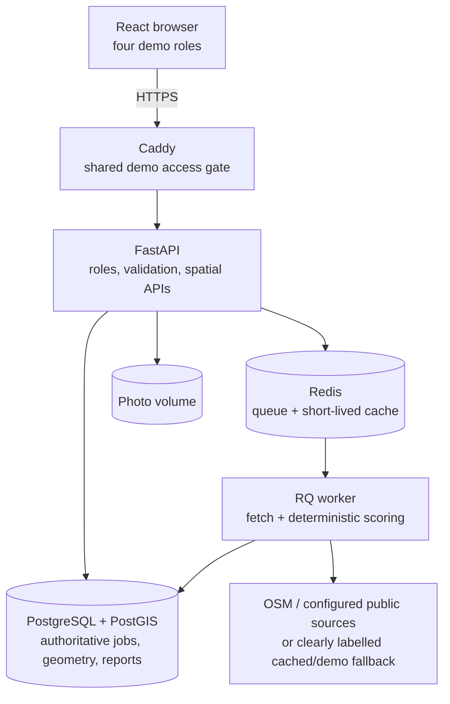

# Savo SiteScout

Savo SiteScout is a Chennai expansion workspace for Savomart. This repository implements the complete **M1 Area Intelligence → M2 Property Scouting → M3 Catchment Study** loop. A BD Manager can carry a real Chennai area from virtual analysis through property scouting, field-survey operations, versioned evaluation, and an audited decision.

## Open the deployed demo

**URL:** [https://savo-sitescout-yogesh-2026.southindia.cloudapp.azure.com/](https://savo-sitescout-yogesh-2026.southindia.cloudapp.azure.com/)

The browser asks for a username and password before showing the app. Use username `sitescout`; the password is stored only in the ignored local `.deploy/demo-password` file on the deploying machine. This **shared outer gate** keeps a publicly reachable hackathon VM from being completely open. It is necessary because the in-app role/user selector sends demo identity headers, **not** verified user credentials. Anyone with the shared password can switch between demo roles, so do not enter confidential production data. Replace both mechanisms with real per-user authentication before production. See the [Azure demo runbook](deploy/README.md) for operations and credit control.

## Workflow at a glance

```mermaid
flowchart LR
    A[BD Manager<br/>select Chennai area] --> B[M1 area analysis<br/>saved report + evidence]
    B --> C[Assign hotspot<br/>to BD Executive]
    C --> D[BD Executive<br/>GPS, details, photos]
    D --> E[M2 property evaluation<br/>version 1]
    E --> F[BD Manager<br/>review + request study]
    F --> G[Survey Manager<br/>review reuse, plan zones]
    G --> H[Survey Executive<br/>draft + lane observations]
    H --> I[M3 catchment summary<br/>evaluation version 2]
    I --> J[BD Manager<br/>compare evidence + decide]
```



| Role | Main work | Handoff |
|---|---|---|
| BD Manager | Select an area, inspect the M1 report, assign a hotspot, review the property pipeline and score history | Scouting assignment, then catchment request |
| BD Executive | Open only assigned work, correct the GPS pin, capture property details and photos | Property and deterministic M2 evaluation |
| Survey Manager | Review requests and reusable coverage, select suggested lanes, create non-overlapping zones, track progress | Assigned survey zones |
| Survey Executive | Restore a local draft, record lane-level observations, submit and complete zones | Catchment summary and new evaluation version |

The score is computed from versioned rules, not an LLM. Reports expose each metric's contribution, source, timestamp, geography, and limitations through **Why this score?**. Real Chennai geometry does not turn demo or simulated signals into real observations; the UI labels those separately.



The Azure demo runs these services on one VM. The API, worker, database, and Redis are not exposed as public ports; Caddy serves the frontend and proxies `/api`. Uploaded photos and database data persist on VM Docker volumes, without automated off-VM backups. See the [deployment runbook](deploy/README.md) for maintenance and cost controls.

## Local startup

Requirements: Docker Desktop with Docker Compose.

```bash
cp .env.example .env
docker compose up --build -d
docker compose exec api alembic upgrade head
docker compose exec -e PYTHONPATH=/app api python scripts/seed_chennai_data.py
```

Open `http://localhost:5173/manager/areas`, keep the clearly labelled demo role set to **BD Manager**, submit a search for `Velachery`, choose an OSM boundary (or an explicitly approximate radius when only a point is returned), and click **Start analysis**. The completed job opens its saved report directly. The API is at `http://localhost:8000`; interactive API docs are at `http://localhost:8000/docs`.

For M2, open a saved report and use **Assign** beside a suggested scouting location. Switch to **BD Executive**, open the assignment, correct the map pin, fill the property form, and select **Save and evaluate**. Switch back to **BD Manager** to inspect the property in the pipeline and record a stage decision.

For M3, move a property to `survey_requested`, then use **Request field evidence** as BD Manager. Switch to **Survey Manager** to inspect the target and reuse coverage on the Chennai map, review any suggested mapped lanes, choose 1-8 zones, and assign survey executives. Switch to **Survey Executive** to restore a local draft, submit lane observations, and complete each zone. The final zone creates a catchment summary, appends a property evaluation version, and returns that property to `under_review`.

### Workspace navigation and entry experience

Savo SiteScout features a modern, accessible operations workspace inspired by responsive consumer applications, customized with SAVOmart purple (`#782B90`), yellow (`#FFF200`), and a crisp white/light map palette:
- **Shareable Leadership Decision Pack**: One-click printable executive dossier (`window.print()` / PDF export) summarizing property specifications, score evolution (v1 physical vs v2 catchment ground truth), value drivers, risk flags, metric provenance, audited stage history, and a formal Retail Expansion Committee sign-off section with contingency checklists.
- **Persona Notifications & Live Activity Feed**: Built-in notification center in the header and sidebar tracking unread operational alerts tailored to the active persona (e.g. BD Manager final review alerts, BD Executive scouting dispatches, Survey Manager catchment requests, and Survey Executive zone drafts).
- **Streamlined Role Selection Dropdown**: An elegant, fast dropdown in the sidebar and mobile header displays all 4 operational roles with their core responsibilities and demo user identities (BD Manager, BD Executive, Survey Manager, Survey Executive).
- **SAVOmart Purple & White Map Palette**: Interactive maps render with a muted light tile canvas making SAVOmart purple (`#782B90`) boundaries, yellow highlights, purple store pins, and emerald survey zones pop with high contrast.
- **Entry Onboarding & Welcome Experience**: An overview introduces the platform, identifies the active role and attention queue, and offers a **Continue to workspace** action (persisted per session, with full `prefers-reduced-motion` support).
- **Adaptive Sidebar**: Smooth toggle, grouped navigation, escape key listener, mobile drawer scrim, and a collapsed state with tooltips.
- **Dynamic "What should I do next?" Action Queue**: Each role workspace analyzes real backend state and presents immediate, prioritized next steps with deep links and a 4-stage lifecycle tracker.
- **Pipeline Stage Guide & Filters**: The BD Manager pipeline provides an interactive filter bar with live counts and an expandable guide defining all lifecycle stages.

| Role | Primary Destinations |
|---|---|
| **BD Manager** | `/manager/areas` (Area Intelligence), `/manager/reports` (Saved Reports), `/manager/assignments` (Dispatch Scout), `/manager/properties` (Property Pipeline), `/manager/catchments` (Catchment Evidence), `/manager/decisions` (Governance & Audit) |
| **BD Executive** | `/executive/assignments` (My Scouting Assignments), `/executive/submitted` (Properties Submitted) |
| **Survey Manager** | `/survey-manager/requests` (Requests Needing Action), `/survey-manager/progress` (Studies in Progress), `/survey-manager/results` (Completed & Reused Catchments) |
| **Survey Executive** | `/survey-executive/zones` (Assigned Zones), `/survey-executive/drafts` (Local Drafts to Restore) |

### Property Pipeline Stage Definitions

The BD Manager property pipeline enforces a deterministic state machine with complete audit history:
- **Scouted**: A BD Executive has submitted field observations, verified the GPS pin, uploaded photos, and generated an initial M2 score (`property-fitness-v1`).
- **Shortlisted**: The BD Manager has reviewed initial field evidence and marked the candidate promising enough for detailed evaluation or catchment surveys.
- **Survey Requested**: The manager has requested M3 catchment ground-truth evidence. This automatically initializes a `CatchmentStudy` in the Survey Manager's workspace for zone partitioning and lane assignment.
- **Under Review**: Catchment field observations have completed (or existing verified study coverage was reused), appending a versioned M3 score (`property-fitness-v2-catchment`). The manager reviews combined property and catchment evidence.
- **Approved**: The manager advances the property within the SiteScout decision workflow based on validated evidence. *(Note: This represents operational recommendation within SiteScout, not legal, lease, or final store-opening authorization).*
- **Rejected**: The manager decides not to advance the property and logs a mandatory audit reason. Rejected candidates remain visible with full provenance.

Area Intelligence does not fetch or render the saved-report list until **View saved reports** is opened. The manager dashboard separately fetches report summaries to show an actual attention count. Report cards open a focused, direct-linkable detail with **Close**, Escape, comparison, original geometry, and **Why this score?**.

Useful checks:

```bash
curl http://localhost:8000/api/v1/health
curl "http://localhost:8000/api/v1/areas/search?q=Velachery&method=locality"
docker compose logs -f worker
backend/.venv/bin/python backend/scripts/verify_m1_flow.py
backend/.venv/bin/python backend/scripts/verify_m2_flow.py
backend/.venv/bin/python backend/scripts/verify_m3_flow.py
docker compose exec -e PYTHONPATH=/app api python scripts/verify_spatial_buffers.py
docker compose exec -e PYTHONPATH=/app api python scripts/verify_m3_reuse_union.py
docker compose exec -e PYTHONPATH=/app api python scripts/verify_full_workflow.py
```

Stop with `docker compose down`. Data volumes are retained. Use `docker compose down -v` only when you deliberately want to erase the local database and Redis data.

## M1 flow

- Locality search is submitted explicitly to OpenStreetMap Nominatim and cached; there is no search-as-you-type or grid geocoding. OSM polygons retain their `osm_type`, `osm_id`, and category as a stable source ID.
- A Nominatim point is never treated as a boundary. The UI requires a clearly labeled 1, 2, or 3 km approximate PostGIS radius, or a user-selected map area.
- Six-digit PIN searches first inspect the configured Department of Posts OGD boundary file. A matching polygon is labeled official; if it is unavailable, any Nominatim result follows the same polygon/point rules as locality search.
- Select and deselect 0.01° latitude by 0.01° longitude cells directly on the Leaflet map. They are degree-based geographic squares, **not equal-area units**. The exact previewed `MultiPolygon` is validated against Greater Chennai bounds, saved in PostGIS, and receives a stable SHA-256 source ID on the server. Switching selection modes clears the previous selection.
- The **GCC ward** mode resolves IDs 001-200 against the bundled 200-feature snapshot of the GCC public `Ward_Boundary` map layer. The backend rejects a modified polygon/source ID before analysis. A saved report retains `gcc:ward:NNN`, the government layer URL, local snapshot file date, and official-source label. The service does not advertise a formal boundary version or publication date; the file date must not be read as an upstream revision date.
- `POST /api/v1/areas/analyses` saves the area and job in PostgreSQL and returns `202 Accepted` with an analysis ID and job ID.
- The Redis/RQ worker records `queued -> fetching -> scoring -> completed` in PostgreSQL. Failures are saved with a useful message and can be retried up to three attempts.
- Reports, metric provenance, suggestions, source snapshots, and geometry are saved in PostgreSQL/PostGIS. Redis is only the queue and short-lived external-response cache.
- Saved reports can be reopened and compared. “Why this score?” exposes raw values, normalization, weight, contribution, source, fetch time, geography, evidence kind, cache age, and limitations.
- The area map displays the 11 Chennai locations from the provided operational-store snapshot as purple SAVOmart pins. Each tooltip shows its source status and snapshot date; the browser never calls the internal store service.
- The provided GCC 2011 ward population and household allocation is spatially joined to verified GCC ward polygons in PostGIS. Reports show area-weighted values only as zero-weight historical proxies with the interpolation limitation.

Role-scoped requests require both `X-Demo-Role` and `X-Demo-User-Id`. Bundled identities are BD Manager `bd-manager-1`, BD Executives `bd-executive-1` / `bd-executive-2`, Survey Manager `survey-manager-1`, and Survey Executives `survey-executive-1` / `survey-executive-2`. The backend enforces role and assignment ownership; this remains lightweight hackathon identity, not production authentication.

## M2 flow

- `scout_assignments` links a persisted M1 report and scouting suggestion to a named executive. The PostGIS hotspot point is copied as the assignment target so the field handoff remains stable.
- The phone-oriented executive form captures a corrected GPS pin, address, rent, size, frontage, road width, property/floor type, visibility, condition, utilities, notes, and up to eight photos.
- Rent must be greater than zero and no more than INR 10,000,000 per month. Property pins are validated within the configured Chennai bounds (`12.75..13.30` latitude, `80.05..80.35` longitude). Invalid form data and uploads return `422` with field-level details.
- JPEG, PNG, and WebP uploads are limited to 5 MB by default. Pillow inspects actual image content, declared MIME must match, and only server-generated filenames are stored. `PROPERTY_PHOTO_STORAGE_PATH` controls storage; Docker uses a dedicated volume.
- An assignment accepts one property capture. A repeat submission returns `409`; an executive accessing another executive's assignment or property receives `404` so object existence is not disclosed.
- PostGIS checks the property against the assigned M1 area, measures straight-line distance from the hotspot, and searches for a possible duplicate within 75 m. These checks create manager-review flags rather than silently rejecting legitimate field corrections.
- Property evaluation combines field inputs with OpenStreetMap features within 750 m and the configured Savomart store adapter. OSM or store fallback data retains the same live, cached, proxy, and demo labels used by M1.
- Evaluation rows are append-only and uniquely versioned per property. M2 creates version 1; completed M3 field evidence appends version N+1 without overwriting prior evidence. The manager review exposes every version and shows the linked catchment contribution, source, timestamp, evidence label, and limitations on the affected version.
- Manager stages are `scouted`, `shortlisted`, `survey_requested`, `under_review`, `approved`, and `rejected`. Only documented transitions are accepted with `409` for an illegal move, and each accepted change stores actor, time, previous stage, next stage, and reason. `survey_requested` is the persisted handoff into an M3 request.

## M3 flow

- A BD Manager requests a catchment against a property or saved M1 area report. Property targets use a configurable 1 km PostGIS radius; area targets retain the saved M1 polygon.
- Before work is created, the system unions all recent completed study coverage (90-day maximum age by default). If the union covers at least **80%** of the target, it is reused immediately. The new record stores every contributing source study ID, age, combined coverage, and creates no survey zones.
- Partial combined overlap below 80% is recorded and removed from `survey_geometry`; only the uncovered remainder is assigned. Both thresholds are configurable with `CATCHMENT_REUSE_MAX_AGE_DAYS` and `CATCHMENT_REUSE_MIN_COVERAGE`.
- The Survey Manager reviews target, remaining geometry, reuse provenance, zones, assignments, and progress on OpenStreetMap. Before planning a requested study, a targeted OSM Overpass road lookup clips mapped ways to the uncovered catchment, groups fragmented ways by road name/highway, and shows up to 100 suggestions with source and fetch time. The manager explicitly checks which suggestions to include; unselected roads are not assigned. A crossing road is linked to the zone containing its longest clipped portion. These are **suggested mapped lanes**, not a complete or field-verified lane inventory. If Overpass is unavailable or finds no roads, the UI explains the gap, offers a retry before zone creation, and keeps manual zone/lane work available.
- The server partitions the remaining polygon into 1-8 clipped, non-overlapping longitudinal work zones and assigns them round-robin to selected executives. Suggested-lane status shows observed versus unvisited; executives can always enter an unmapped lane.
- Survey Executives capture lane/street, point location, GPS accuracy, observation time, residential and commercial unit counts, pedestrian and vehicle activity ratings, and notes. Points outside a zone by more than the greater of reported GPS accuracy or 100 m are retained but flagged for manager review.
- Every lane submission carries a browser-generated UUID. Retrying the same UUID returns the original record rather than creating a duplicate. Executives receive `404` for another executive's zone.
- Entered incomplete forms autosave to browser `localStorage` per zone, including the submission UUID and corrected map point. Merely opening an untouched zone does not create a draft. Refresh or **Local Drafts to Restore** returns to that zone. Submitted drafts are removed; this is lightweight recovery, not an offline synchronization engine.
- Completing every zone aggregates timestamped counts, ratings, spatial coverage, mismatch count, source, and limitations. For a property, the system appends evaluation version N+1 and moves `survey_requested` to `under_review` with an audit transition.

## Catchment scoring rules

The catchment ruleset is `property-fitness-v2-catchment`. It scales the previous property's metric weights and contributions to 90%, then adds a 10% field-observed catchment metric. That metric combines residential units per observation (40%), commercial units per observation (25%), pedestrian activity (20%), and vehicle activity (15%), with each component capped at 1. Scripted walkthrough observations are stored and displayed as `demo`; user submissions are `field-survey`. Counts are observations, not census population, household totals, income, or continuous footfall.

## Property scoring rules

The deterministic ruleset is `property-fitness-v1`. Every normalized value is clamped to `0..1`; contribution is `normalized * weight * 100`. No LLM calculates or invents property figures.

| Signal | Normalization | Weight |
|---|---|---:|
| Rent efficiency | `1 - min(rent per sq ft / 150, 1)` | 20% |
| Store size fit | `1.0` for 1,200-3,000 sq ft; `0.6` for 800-4,000; otherwise `0.2` | 15% |
| Frontage | `min(frontage ft / 30, 1)`; missing is `0` | 10% |
| Road access | `min(road width ft / 40, 1)`; missing is `0` | 10% |
| Street visibility | field rating divided by `5` | 10% |
| Property condition | field rating divided by `5` | 7% |
| Access and utilities | parking, backup power, and water available divided by `3` | 8% |
| Nearby mapped activity | `min((shops + amenities + access within 750 m) / 60, 1)` | 10% |
| Competition headroom | `1 - min(mapped competitors within 750 m / 10, 1)` | 5% |
| Savomart coverage gap | `min(nearest store km / 5, 1)`; unavailable uses neutral `0.5` | 5% |

Scores are labeled Strong candidate (`>=70`), Promising (`>=55`), Needs review (`>=40`), or Weak candidate (`<40`). Public mapped features are context signals, not population, footfall, or complete business counts. Field values are self-reported until manager validation. Bundled simulated evidence is visibly labeled and does not become real because it is combined with a real GPS point.

## Data sources and evidence labels

- **OpenStreetMap Nominatim** supplies submitted locality lookup results. Polygon results are labeled `osm-derived`; point results require a radius or map selection. The public endpoint is configurable, results are cached for 24 hours, stale entries can be used for seven days after an upstream failure, and requests identify this application. See the [Nominatim usage policy](https://operations.osmfoundation.org/policies/nominatim/) and [search API](https://nominatim.org/release-docs/latest/api/Search/).
- **OGD India / Department of Posts** is the preferred pincode-boundary source. Download `All India Pincode Boundary Geo JSON` from the [official OGD catalog](https://www.data.gov.in/catalog/all-india-pincode-boundary-geo-json), place the GeoJSON or GeoJSONL file in `backend/data/`, and set `OGD_PINCODE_BOUNDARIES_PATH=/app/data/<filename>`. The source is released under the Government Open Data License - India. The app does not silently substitute a geocoded point for a PIN polygon.
- **Public Chennai pincode feature layer** provides configurable fallback coverage, including `600042`. It is labeled `third-party` and non-official because its publisher metadata does not establish Department of Posts authority. Set `CHENNAI_PINCODE_FEATURE_URL=` to disable it. A configured, matching OGD file always wins.
- **OpenStreetMap Overpass API** supplies mapped buildings, shops, offices, amenities, transit features, and competitors inside the selected geometry. The worker filters bounding-box responses against the selected polygon.
- **Savomart operational stores** come from `backend/data/savomart_operational_stores.json`, a provided 74-store operational snapshot containing 11 Chennai stores. The seed command validates stable store codes and coordinates before persisting them in PostGIS. When `STORE_SERVICE_URL` and `STORE_SERVICE_TOKEN` are supplied server-side in ignored `.env`, both the seed command and scoring adapter refresh through HTTP `GET` with redirects enabled and no request body; scoring caches the sanitized response in Redis. The supplied snapshot is the labelled fallback; no credential is committed, logged, documented, or exposed to the browser.
- **GCC ward census source** combines the attached `gcc_ward_population_census_2011.csv` with a 200-feature snapshot from the official GCC `GCC_AdminBoundary` ward layer. The join requires one unique row and polygon for every ward ID from 001 through 200. Population and household values remain historical 2011, are area-weighted for arbitrary selections, have zero scoring weight, and are visibly labelled proxy data.
- **GCC ward geometry source** is the public [Greater Chennai Corporation `Ward_Boundary` layer (ID 4)](https://gisgcc.chennaicorporation.gov.in/server/rest/services/GCCPublic/GCC_AdminBoundary/MapServer/4), imported in `backend/data/gcc_ward_boundaries.geojson`. It is a government-published polygon snapshot, not a new survey. The app stores each ward ID, source URL, polygon, and local file modification date in PostGIS, separately from the store snapshot refresh time. The UI's `lookup_at` field for this mode is that local snapshot date, **not** an asserted government fetch/publication date. The service metadata does not state a reusable license or formal revision number; confirm redistribution/production-use rights and refresh against the current layer before production use. If the 200-ward seed is absent, ward lookup returns an unavailable state rather than inventing a boundary.
- **Suggested road/lane source** is OpenStreetMap highway ways through the configured `OVERPASS_URL` (default `https://overpass-api.de/api/interpreter`), subject to ODbL attribution. Only an opened requested catchment is queried, by bounding box; results are clipped to the uncovered polygon and filtered to surveyable mapped highway types. Successful lookups are cached in Redis for 24 hours and the selected suggestion snapshot is persisted with the study. No stale road snapshot is substituted after a failed lookup. Service outages leave manual planning available, and no road geometry is interpreted as households, activity, or survey findings.
- **Bundled demo evidence** keeps the Velachery scoring walkthrough usable if Overpass or the store service is unavailable. It is labeled `demo/simulated` beside affected values. Bundled store points are illustrative, not current operational-store claims. There is no bundled demo geography fallback.
- **Simulated signal fallback** keeps arbitrary map-cell workflows usable when Overpass and Redis cache are both unavailable. It uses fixed density baselines, is labeled `demo/simulated` on every affected metric, and explicitly says it is not an observation about the selected area. Set `ALLOW_SIMULATED_SIGNAL_FALLBACK=false` to make these jobs fail instead.
- **Redis cache** keeps successful OSM responses for one hour and an eligible stale snapshot for seven days. If an upstream failure causes stale evidence to be used, the report is labeled `cached` and shows its age.

The UI legend distinguishes real geography, sourced, cached, proxy, field, missing, and demo/simulated data. OpenStreetMap counts are mapped-feature coverage signals. They are **not** population, household, footfall, income, or complete business counts. Seeded GCC people values are historical, area-weighted proxies with zero scoring weight; without the seed they remain unavailable. Residential-building density is labeled as a homes proxy, never converted into people. A real boundary does not make simulated business or store inputs real.

## Scoring rules

The deterministic ruleset is versioned as `area-fitness-v2`. Each normalized value is clamped to `0..1`; contribution is `normalized * weight * 100`.

| Signal | Normalization | Weight |
|---|---|---:|
| Mapped residential buildings | `min(features_per_km2 / 60, 1)` | 25% |
| Mapped shops and offices | `min(features_per_km2 / 40, 1)` | 20% |
| Mapped daily-life amenities | `min(features_per_km2 / 20, 1)` | 20% |
| Mapped transit access | `min(features_per_km2 / 25, 1)` | 15% |
| Competition headroom | `1 - min(competitors_per_km2 / 8, 1)` | 10% |
| Savomart coverage gap | `min(nearest_store_km / 3, 1)` | 10% |

If store data is unavailable, coverage gap uses a documented neutral normalized value of `0.5`. Scores are labeled Strong fit (`>=70`), Promising (`>=55`), Needs validation (`>=40`), or Low evidence fit (`<40`). The explanation is generated deterministically from saved evidence; no LLM key or provider is required, and no LLM determines the score.

The area-weighted 2011 population and household proxies are informational metrics with `0%` weight. They never alter the numeric fitness score.

## Architecture and schema

- `frontend`: React, TypeScript, Vite, React Leaflet, and OpenStreetMap tiles.
- `api`: FastAPI validation, role and ownership guards, area search/jobs/reports, assignments, property capture, image delivery, evaluation, pipeline, and health endpoints.
- `worker`: separate Python RQ process for enrichment and scoring.
- `postgres`: PostgreSQL 16/PostGIS is authoritative for area geometry, job progress, reports, evidence, and source snapshots.
- `redis`: RQ queue plus bounded external-data cache.

Core M1 tables are `areas`, `area_analyses`, `analysis_jobs`, `area_reports`, `area_metric_evidence`, `scouting_suggestions`, `external_data_snapshots`, `operational_stores`, and `ward_census`. M2 adds `scout_assignments`, `properties`, `property_photos`, `property_evaluations`, and `property_stage_transitions`. M3 adds `catchment_studies`, `survey_zones`, and `lane_captures`; `source_study_ids` tracks each prior study contributing reused coverage. Stored geometry uses SRID 4326 with GiST spatial indexes. M2's 750 m evidence buffer uses PostGIS geography; M3 area/overlap ratios and zone partitions use EPSG:32644 metre coordinates. See [ARCHITECTURE_MERGED.md](ARCHITECTURE_MERGED.md) for the current architecture and [Decisions.md](Decisions.md) for scope and product decisions.

## Development checks

```bash
cd backend
.venv/bin/python -m pip install --upgrade 'pip>=26.2'
.venv/bin/pip install -e '.[dev]'
.venv/bin/ruff check app tests scripts
.venv/bin/bandit -r app scripts -q
.venv/bin/pytest -q
.venv/bin/pip-audit

cd ../frontend
npm install
npm run build
npm audit
```

## Verification scope

`backend/scripts/verify_full_workflow.py` creates an isolated Chennai map-cell analysis, uploads an actual in-memory JPEG with the property capture, completes a two-zone catchment study, retries the same lane-submission UUID, and verifies evaluation versions and decision history. It mutates the local development database and deliberately uses demo-labelled field observations. The two PostGIS verification scripts exercise metre-based property buffers and multi-study coverage-union reuse against the running database.

The complete persona workflow has been verified locally through Docker Compose and the browser at `http://localhost:5173`. No deployed environment or production identity provider was tested. No LLM provider is configured or called at runtime; when AI is unavailable, saved deterministic evidence and rule-based explanations remain the entire scoring and explanation path.

## Current limitations

- OSM locality boundaries reflect contributor coverage and may represent neighborhoods inconsistently. Nominatim point-only results require an explicitly approximate radius or map selection. GCC ward polygons cover the 200 IDs in the bundled snapshot, not areas outside the corporation or an independently verified current revision; publication/reuse terms need checking before production redistribution.
- PIN boundaries require a locally configured official OGD file because the OGD portal download flow is not a stable anonymous runtime API. Unsupported or missing PIN polygons are reported rather than invented.
- Location cache entries live for 24 hours; stale cached lookups are eligible for seven days only after an upstream failure, and their age is shown. Overpass signal cache remains one hour with the same seven-day stale ceiling.
- Map cells are geographic squares rather than a city-wide precomputed grid. This is deliberate: there is no mandatory H3 heatmap.
- Straight-line store distance is used instead of routing time. Scouting suggestions are mapped activity clusters that require field validation.
- Mapped-lane suggestions depend on Overpass availability and OSM completeness. During the local UI walkthrough on 30 September 2026, Overpass was unavailable: the application showed the failure and successfully created manual, non-overlapping zones. Clipping/grouping, explicit inclusion, single-zone lane assignment, and retry are covered by focused backend tests, but a live mapped-lane assignment was not verified in that walkthrough.
- The GCC people source is a 2011 ward allocation, not a current census. Area-weighting assumes uniform distribution within each intersected ward, so it is a planning proxy rather than an exact selected-area count and remains excluded from scoring.
- Demo role switching is not production authentication. Property photos use local/Docker-volume storage rather than production object storage, distances are straight-line rather than routed, and field details are not independently verified.
- M2 performs evaluation during property submission, so a slow public Overpass request can delay the save; the configured cache and labeled demo fallback keep the hackathon walkthrough available. A production deployment should move enrichment to a durable job.
- M3 uses projected longitudinal polygon strips clipped to the target rather than road-network workload balancing. Managers cannot manually redraw vertices in this version.
- For multi-study reuse, coverage geometry and source IDs are combined. The study's observation statistics currently come from the most recent contributing study rather than a spatially deduplicated aggregation of all source observations; interpret reused scores with that limitation.
- Draft recovery is device-local. It does not sync drafts across devices, merge conflicts, cache map tiles, or upload photos offline.
- Completed zones require at least one observation, but this version does not impose a statistically representative lane sample size. Managers must inspect coverage and limitations.
- Advanced cannibalisation, OSRM routing, PDF export, full offline sync, and a conversational analyst remain out of scope.
- The verification environment is local Docker Compose only. Production deployment, TLS, durable object storage, backup/restore, and external identity-provider integration have not been verified.

## AI usage

The repository was built with Codex in the Codex desktop app for architecture interpretation, implementation, tests, and documentation. The runtime product does not require or call an LLM. The final submission should add a shared/exported AI session link and demo-video link here when available.
